# Use Case Diagram — Error Catalog

> **What this is:** a catalog of common mistakes in UML use case diagrams, with an
> error and its fix for each case. It is an English transcription of chapter
> **1 Use Case Diagram** from the document *Katalog chyb v UML diagramech*
> ("Catalog of errors in UML diagrams", PB007 — Software Engineering I).
>
> - Diagrams (Figures 1–18, 27–36) are rewritten in **PlantUML**. PlantUML lays
>   elements out automatically, so exact positions differ from the original;
>   preserved are the elements, relationships, arrow directions, stereotypes and
>   error highlighting (red). Blocks contain `!pragma layout smetana`, so they
>   render even without Graphviz installed.
> - **All text, including use case and actor names, is translated to English.**
> - Textual specifications (Figures 19–26) are not diagrams but tables — rewritten
>   as **markdown tables**. Error rows (red-underlined in the original) are **bold**
>   and marked ⚠.

---

## 1.1 Use case describing an activity outside the system

In the following example, the use case "Call Call Centre" is highlighted. A customer who discovers
a problem can fill in an online form or call the call centre. Unlike filling in the form, the phone
call will not be handled by the modelled software, so the use case must be removed from the diagram.

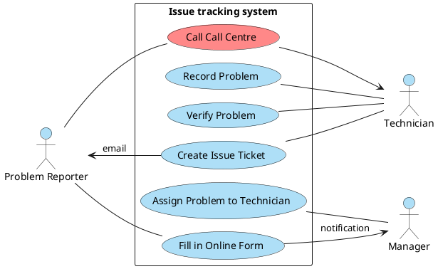
*Figure 1: Use case describing an activity outside the system*

If the customer reports the problem by phone, the technician registers the problem in the system
based on the information provided, and from then on the course of both reporting options is the same.

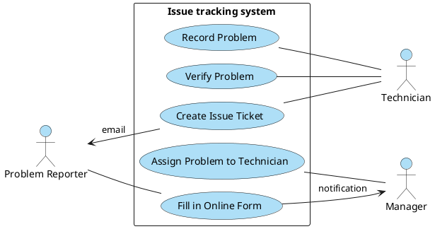
*Figure 2: Use case describing an activity outside the system - solution*

---

## 1.2 Reversed direction of the «include» relationship

The «include» relationship is chosen correctly in the following example, but its direction is reversed.

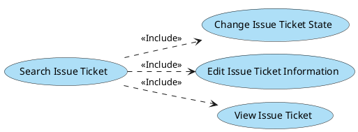
*Figure 3: Reversed direction of «include»*

The correct direction of the «include» relationship is from the base use case to the included one.
For example, "Change Issue Ticket State" contains the steps of the use case "Search Issue Ticket",
therefore "Change Issue Ticket State" is the base use case and "Search Issue Ticket" the included one.

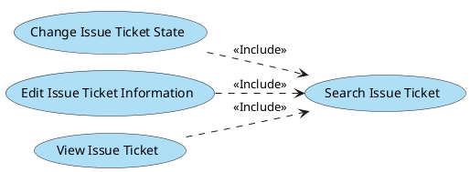
*Figure 4: Reversed direction of «include» - solution*

---

## 1.3 Reversed direction of the «extend» relationship

In the following example the «extend» relationship is chosen correctly, but has a reversed direction.

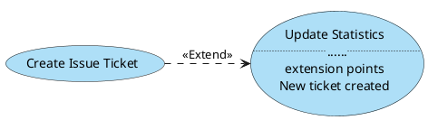
*Figure 5: Reversed direction of «extend»*

The correct direction of the «extend» relationship is from the extending use case to the main one.
The extending use case is in this case "Update Statistics". It extends the main use case
"Create Issue Ticket", in which the relevant extension point is located.

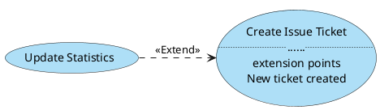
*Figure 6: Reversed direction of «extend» - solution*

---

## 1.4 «include» relationship - the included use case does not make sense in different base use cases

The included use case has a given sequence of steps that is executed identically in different base
use cases. One of the numbered steps of the base use case is a reference to the included use case.
At this point all steps of the included use case are performed and then the flow returns to the main
use case. In the following example the included use case is executed in different base use cases
through different forms, therefore the «include» relationship does not make sense.

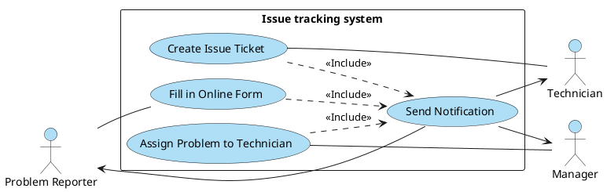
*Figure 7: The included UC "Send Notification" behaves differently in different base UCs*

The solution is to find suitable more specific replacements for the overly general included use case,
or to specify the steps separately in the different base use cases.

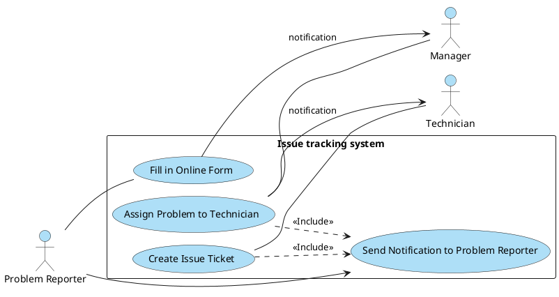
*Figure 8: The included UC "Send Notification" behaves differently in different base UCs - solution*

---

## 1.5 A directed use case–actor relationship is missing the arrow at its end

The example below shows the use case "Create Issue Ticket" and the actors problem reporter and
technician. The problem reporter does not communicate with the use case in any way, but if the
technician triggers the use case, they are informed about it by e-mail. Therefore the arrow is
missing at the end of the communication relationship.

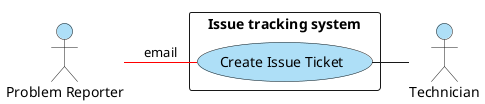
*Figure 9: Relationship without an arrow*

After adding the arrow to the relationship between the problem reporter and the use case, it is clear
that the communication is one-way.

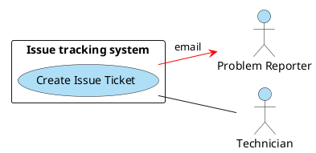
*Figure 10: Relationship with an arrow*

---

## 1.6 Using a System actor to represent the modelled system

The modelled system is represented in the diagram by the system boundary and the individual use
cases. Therefore using a System actor is an error. In some cases it is possible to replace the System
actor with a Time actor.

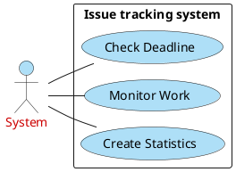
*Figure 11: Diagram with a System actor*

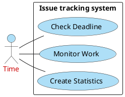
*Figure 12: Diagram with a Time actor*

---

## 1.7 Misusing «include» or generalization between use cases for functional decomposition

Functional decomposition arises when an overly general use case is gradually broken down into more
specific use cases, sometimes across several levels. The «include» relationship or generalization
between use cases can be misused for functional decomposition.

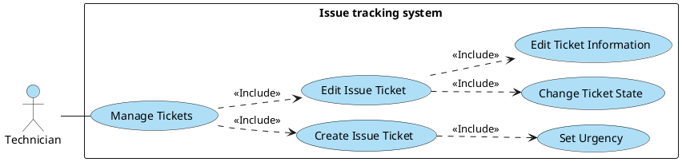
*Figure 13: Functional decomposition using «include»*

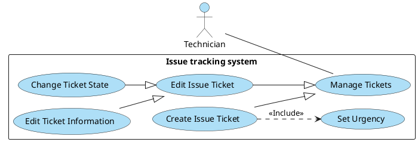
*Figure 14: Functional decomposition using generalization of use cases*

To remove functional decomposition, the general use cases that have no functionality of their own are
deleted, and the more specific use cases are connected to the actors directly.

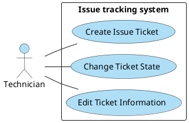
*Figure 15: Diagram without functional decomposition*

---

## 1.8 Inappropriate use of actor generalization

Generalization is not appropriate when actors share the same use cases but their relationship does not
have "IsA" semantics, i.e. when it cannot be claimed that the specialized actor is at the same time
the general actor. These semantics are missing in the next example; the internal and external problem
reporters are disjoint.

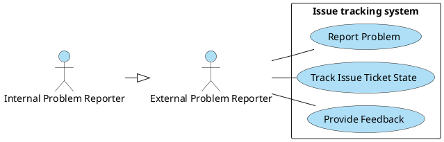
*Figure 16: Inappropriate case of actor generalization*

The solution may be to remove the generalization or, in this case, to find a suitable abstraction for
both actors.

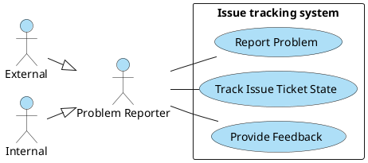
*Figure 17: Inappropriate case of actor generalization - solution*

---

## 1.9 Inheriting unwanted use cases

A specialized actor inherits all use cases from the general one. The registered problem reporter
therefore also inherits the use case "Register". Moreover, this generalization is inappropriate,
see the previous point.

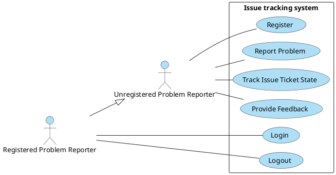
*Figure 18: Inheriting the unwanted UC "Register"*


## 1.11 Unnecessary include [Recommendation]

If the included use case relates to only one main use case, it is better to insert its steps directly
into the main use case and simplify the diagram.

```plantuml
@startuml
!pragma layout smetana
left to right direction
skinparam shadowing false
skinparam usecaseBackgroundColor #AEDFF7
skinparam actorBackgroundColor #AEDFF7
usecase "Create New Ticket" as VNT
usecase "Set Urgency" as NN
VNT ..> NN : <<Include>>
@enduml
```
*Figure 27: Unnecessary «include»*

---

## 1.12 Missing actor generalization in a suitable case [Recommendation]

If the diagram contains actors that have several use cases in common and are in an "IsA" semantic
relationship, it is appropriate to use actor generalization.

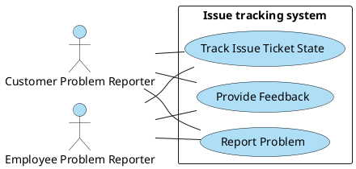
*Figure 28: A suitable case for actor generalization*

The example shows a suitable case for actor generalization. Generalization simplifies the diagram.
The solution is to create a new general actor and assign two of its specialized actors.

```plantuml
@startuml
!pragma layout smetana
left to right direction
skinparam shadowing false
skinparam usecaseBackgroundColor #AEDFF7
skinparam actorBackgroundColor #AEDFF7
actor "Problem Reporter" as NP
actor "External" as E
actor "Internal" as I
rectangle "Issue tracking system" {
  usecase "Report Problem" as NHP
  usecase "Track Issue Ticket State" as SSIT
  usecase "Provide Feedback" as PZV
}
E --|> NP
I --|> NP
NP -- NHP
NP -- SSIT
NP -- PZV
@enduml
```
*Figure 29: Case using actor generalization*

---

## 1.13 Inappropriate naming of actors [Recommendation]

The following diagram contains at the same time the actors technician and employee, who is a
specialized actor of the problem reporter. For understanding the diagram this naming is inappropriate,
because outside the system the technician is a role of the employee.

```plantuml
@startuml
!pragma layout smetana
left to right direction
skinparam shadowing false
skinparam usecaseBackgroundColor #AEDFF7
skinparam actorBackgroundColor #AEDFF7
actor "<color:#CC0000>Technician</color>" as T
rectangle "Issue tracking system" {
  usecase "Report Problem" as NHP
  usecase "Create Issue Ticket" as VIT
  usecase "Change Issue Ticket State" as ZST
}
actor "Problem Reporter" as NP
actor "<color:#CC0000>Employee</color>" as Z
actor "Customer" as ZA
T -- VIT
T -- ZST
NHP -- NP
Z --|> NP
ZA --|> NP
@enduml
```
*Figure 30: Inappropriate naming of actors*

The solution is to find more suitable names for the actors, here for example internal and external
problem reporter.

```plantuml
@startuml
!pragma layout smetana
left to right direction
skinparam shadowing false
skinparam usecaseBackgroundColor #AEDFF7
skinparam actorBackgroundColor #AEDFF7
actor "<color:#CC0000>Technician</color>" as T
rectangle "Issue tracking system" {
  usecase "Report Problem" as NHP
  usecase "Create Issue Ticket" as VIT
  usecase "Change Issue Ticket State" as ZST
}
actor "Problem Reporter" as NP
actor "<color:#CC0000>Internal</color>" as I
actor "External" as E
T -- VIT
T -- ZST
NHP -- NP
I --|> NP
E --|> NP
@enduml
```
*Figure 31: Inappropriate naming of actors - solution*

---


## 1.15 Modelling another system as an actor [Recommendation]

If the actor is another system, it should have a rectangle symbol with the «actor» stereotype or a
stick figure with the «system» stereotype.

```plantuml
@startuml
!pragma layout smetana
left to right direction
skinparam shadowing false
skinparam usecaseBackgroundColor #AEDFF7
skinparam actorBackgroundColor #AEDFF7
rectangle "<<actor>>\nAlarming system" as AS #AEDFF7
rectangle "Issue Tracking System" {
  usecase "Monitor System" as MS
  usecase "Create Issue Ticket" as VIT
}
AS -- MS
AS -- VIT
@enduml
```
*Figure 34: System actor with a rectangle symbol*

```plantuml
@startuml
!pragma layout smetana
left to right direction
skinparam shadowing false
skinparam usecaseBackgroundColor #AEDFF7
skinparam actorBackgroundColor #AEDFF7
actor "Alarming system" as AS <<system>>
rectangle "Issue Tracking System" {
  usecase "Monitor System" as MS
  usecase "Create Issue Ticket" as VIT
}
AS -- MS
AS -- VIT
@enduml
```
*Figure 35: System actor with the «system» stereotype*

---

## 1.16 Use case names [Recommendation]

Use case names should have the form of a verb phrase and express an activity from the point of view
of the actor who communicates with the use case.

```plantuml
@startuml
!pragma layout smetana
left to right direction
skinparam shadowing false
skinparam usecaseBackgroundColor #AEDFF7
skinparam actorBackgroundColor #AEDFF7
together {
  usecase "New Issue Ticket" as A1
  usecase "Notification" as A2
  usecase "Issue Ticket State Change" as A3
  usecase "Deadline Check" as A4
}
together {
  usecase "Create New Ticket" as B1
  usecase "Send Notification" as B2
  usecase "Change Issue Ticket State" as B3
  usecase "Check Deadline" as B4
}
A1 -[hidden]- B1
@enduml
```
*Figure 36: Inappropriate (left) and appropriate (right) UC names*
